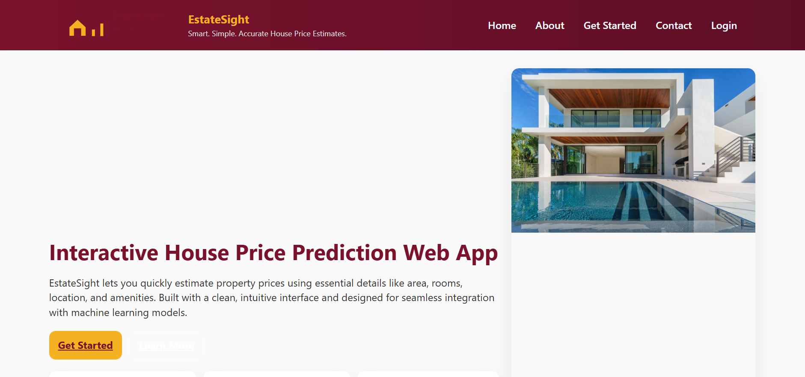
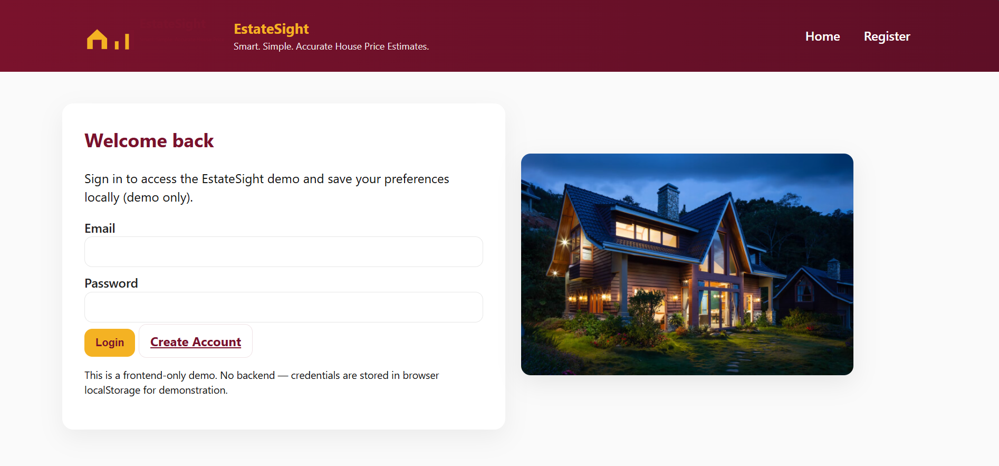
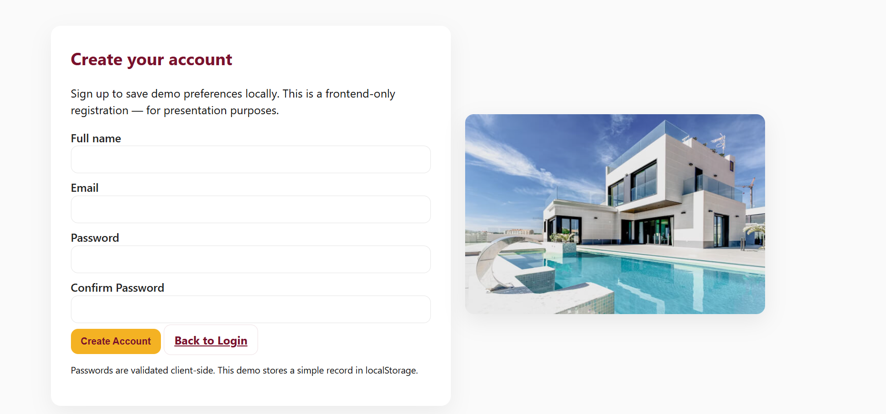
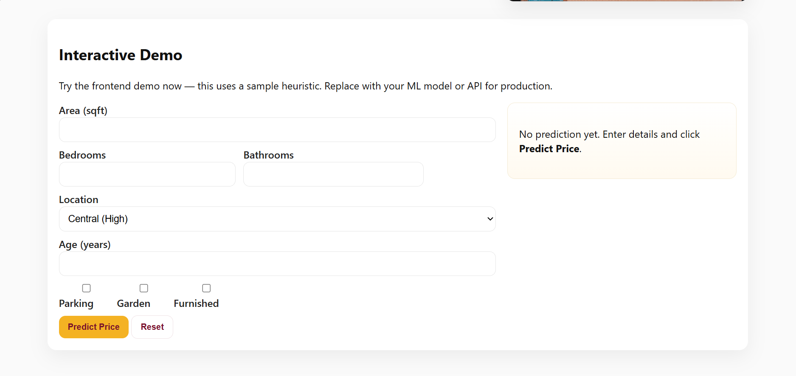
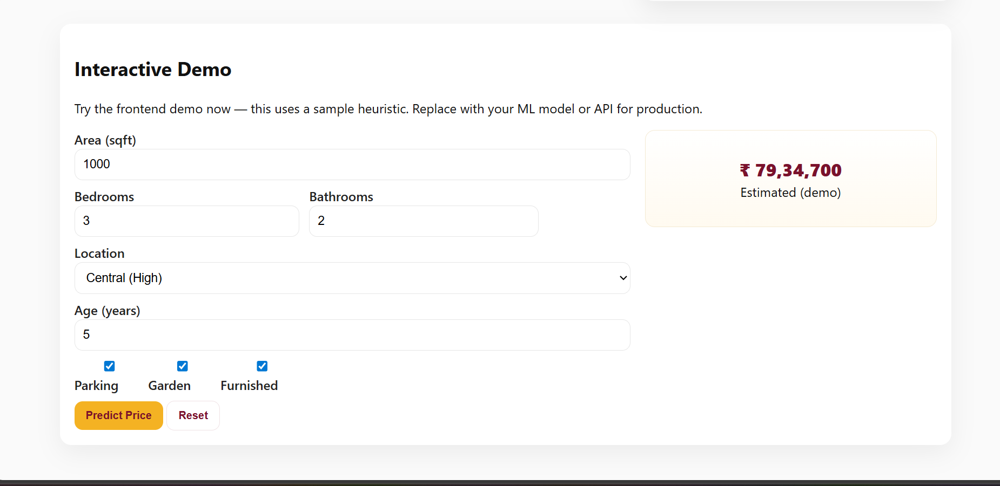

# 🏡 EstateSight — Interactive House Price Prediction Web App  
### *Smart. Simple. Accurate Price Estimates.*

EstateSight is a modern, responsive **interactive house price prediction web application** that allows users to estimate property prices based on key features like area, rooms, age, amenities, and location.  
It includes a **complete login & registration system**, a **protected demo**, a stylish UI, and is designed to easily integrate with real machine learning models.

This project was developed as part of the **BCC351 — Web Development Lab (3rd Semester)** at **ABES Engineering College**.

## 🌟 Highlights

### 🧮 **Interactive Price Prediction**
Predict prices using:
- Area (sqft)
- Bedrooms & bathrooms
- Age of property
- Location tiers (Low / Medium / High)
- Amenities (Parking, Garden, Furnished)

### 🔐 **Authentication System**
- User Registration  
- Login  
- Session-based access  
- Personalized welcome banner  
- "Login required" overlay if accessing protected features  

### 🎨 **Clean, Modern UI/UX**
- Hero banner with tagline  
- Real-estate themed images  
- Navbar with smooth navigation  
- About section with image gallery  
- Mobile-friendly responsive layout  

### 💻 **Frontend-Only Architecture**
No backend required — everything works using:
- HTML5  
- CSS3  
- Vanilla JavaScript  
- localStorage + sessionStorage  

### 🤖 **ML-Ready Design**
The current pricing logic uses a heuristic for demonstration.  
You can easily connect:
- TensorFlow.js model  
- ONNX  
- Python API (Flask/FastAPI/Django)  
- Node.js backend  

## 📸 Screenshots

### 🏠 Home Page

### 🔐 Login Page

### 📝 Registration Page

### 🧮 Price Estimator (Before Prediction)

### 💰 Price Estimator (After Prediction)

## 🏗️ Tech Stack

| Component | Technology |
|----------|------------|
| Structure | HTML5 |
| Styling | CSS3 (Custom, Responsive) |
| Logic | JavaScript (Vanilla) |
| Auth | localStorage + sessionStorage |
| Deployment | GitHub Pages |

## 🎯 Project Motivation

Real-estate websites rely on machine learning to estimate property values.  
As a Data Science student, integrating ML with UI is important — but most ML models lack good frontends.

EstateSight solves this by offering:
- A clean, intuitive interface  
- A ready frontend for future ML integration  
- A full working login system  
- A professional-level user experience  

## 🔍 How It Works

### ✔ Authentication (`auth.js`)
- Registers new users (saved in localStorage)
- Login creates a session (sessionStorage)
- Prevents demo access without login
- Shows personalized welcome message
- Logout destroys session

### ✔ Pricing Logic (`app.js`)
The demo prediction formula uses:
- Area × base rate  
- Bedroom & bathroom multipliers  
- Location multipliers  
- Amenity bonuses  
- Age depreciation  

➡ Replace this with `fetch()` to call a real ML model whenever ready.

## 🛠️ How to Run Locally

### 1. Clone or Download the Repository:

### 2. Open the folder.

### 3. Open `index.html` in any browser.

✔ No installation  
✔ No backend  
✔ No server required  

## 🌐 Deployment (GitHub Pages)

To host the website:

1. Go to **Settings → Pages**
2. Under **Branch**, select:
3. Under **Folder**, select:
4. Save  
5. GitHub will generate a live link within 30–60 seconds.

## 🧩 Future Enhancements

- Integrate real ML model (TFJS / Python API)
- Add price visualizations (charts)
- Add comparison tool for properties
- Add dark mode
- Add forgot password feature
- Full backend with database & JWT auth

## 👨‍🏫 Academic Details

**Course:** BCC351 — Mini Project (Web Development Lab)  
**College:** ABES Engineering College  
**Student:** Muskan Varshney (Section A)  
**Year:** 3rd Semester (CSE - Data Science)

## 👩‍💻 Developer

**Muskan Varshney**  
*B.Tech CSE - Data Science*  
GitHub: https://github.com/muskanv26  
Project: EstateSight — Interactive House Price Prediction  

## 📝 License

This project is open for academic and educational use.

---

